# Proof Dependency Graph

## 1. Graphviz output

```dot
digraph proofs {
    rankdir=LR;
    node [shape=box, style=rounded];

    // Definitions / setup
    mondeq      [label="01. Def: monDEQ\n(def:mondeq)"];
    fbs         [label="02. Def: FBS iter"];
    upper_LT    [label="03. Prop: Lipschitz of T_alpha\n(upper_LT)"];
    PL_def      [label="05. Def: PL inequality"];
    PL_linear   [label="06. Thm: linear conv under PL\n(Hamed2016)"];
    g_def       [label="07. Def: residual g_theta"];
    cond_C1     [label="15. Condition C1\n(C1a, C1b)"];

    // Lemmas
    Zstar_norm  [label="04. Lem: ||Z*||_F <= ||U|| ||X|| / m\n(Zstar_norm)"];
    deri_g      [label="08. Lem: d g_theta\n(deri_g)"];
    deri_Z      [label="09. Lem: d Z*\n(deri_Z)"];
    grad_loss   [label="10. Lem: d L\n(grad_loss)"];
    VQ          [label="11. Lem: ||(u^T x I) Q^-1|| <= ||u||/m\n(upperbound_VQ)"];
    grad_bounds [label="12. Lem: gradient bounds\n(grad_bounds)"];
    Z_perturb   [label="13. Lem: Z* perturbation\n(Zstar_perturb)"];
    drift       [label="14. Lem: parameter drift bounds\n(drift)"];
    exp_decay   [label="17. Cor: exponential decay\n(cor:exp_decay)"];

    // Main theorem
    main        [label="16. Thm: GLOBAL CONVERGENCE\n(main_continuous)", style="rounded,filled", fillcolor="#FFE082"];

    // Dependencies (Node A -> Node B means B depends on A)
    mondeq -> fbs;
    mondeq -> g_def;
    mondeq -> deri_Z;
    mondeq -> Z_perturb;

    fbs -> Zstar_norm;
    upper_LT -> Zstar_norm;
    Zstar_norm -> grad_bounds;
    Zstar_norm -> Z_perturb;
    Zstar_norm -> main;

    g_def -> deri_g;
    deri_g -> deri_Z;
    deri_Z -> grad_loss;
    grad_loss -> grad_bounds;
    grad_loss -> exp_decay;

    upper_LT -> VQ;   // The faulty appendix proof of VQ tries to use upper_LT
    VQ -> grad_bounds;

    grad_bounds -> drift;
    grad_bounds -> exp_decay;

    drift -> main;
    Z_perturb -> main;
    exp_decay -> main;
    cond_C1 -> main;
    PL_def -> exp_decay [style=dashed, label="motivation"];
    PL_linear -> main [style=dashed, label="motivation"];

    // Color critical nodes
    VQ        [style="rounded,filled", fillcolor="#FFCDD2"];  // proof faulty
    Z_perturb [style="rounded,filled", fillcolor="#FFCDD2"];  // proof has gap
}
```

## 2. Prose summary (layered structure)

**Layer 0 — Setup (definitions, no proofs).**
[[01_def_mondeq]] (monDEQ + parametrization $W = (1-m)I - A^\top A + B - B^\top$) → [[02_def_fbs]] (FBS iteration). Loss is squared error $\mathcal L = \tfrac12 \|Z^{*\top}\mathbf u - \mathbf y\|^2$. The [[05_def_PL]] is defined for motivation; the [[06_thm_PL_linear]] is mentioned as a discrete-time analogue.

**Layer 1 — Forward analysis.**
[[03_prop_upper_LT]] (Lipschitz of $T_\alpha$, cited from prior work) is used to prove [[04_lem_Zstar_norm]] (bound $\|Z^*\|_F \leq \|U\|\|X\|/m$).

**Layer 2 — Gradient algebra.**
[[07_def_residual]] $g_\theta(Z;X) = Z - \sigma(WZ + UX)$. [[08_lem_deri_g]] computes the four partials of $g_\theta$ (the appendix proof has sign/notation issues). Apply IFT to get [[09_lem_deri_Z]] (partials of $Z^*$). Chain to $\mathcal L$: [[10_lem_grad_loss]].

**Layer 3 — Bound the gradient.**
[[11_lem_upperbound_VQ]] is the **core bound** $\|(\mathbf u^\top \otimes I_N) Q^{-1}\| \leq \|\mathbf u\|/m$, used to derive [[12_lem_grad_bounds]] (Lipschitz-style upper bounds for $\nabla_A, \nabla_B, \nabla_U, \nabla_\mathbf u$). These plus FTC give [[14_lem_drift]] (parameter drift over $[0, T]$).

**Layer 4 — Perturbation and PL-style descent.**
[[13_lem_Zstar_perturb]] bounds $\|Z^* - Z^{*'}\|$ in terms of parameter perturbations. [[17_cor_exp_decay]] uses $\sigma_{\min}(Z^*(t)) \geq \lambda_0/2$ (a hypothesis that will become Property 2 in the main theorem) plus the readout-only PL trick to get $\dot{\mathcal L} \leq -(\lambda_0^2/2)\mathcal L$, hence Grönwall.

**Layer 5 — Main theorem.**
[[16_thm_main_continuous]] runs continuous induction with the three properties P1 (drift bound), P2 ($\sigma_{\min}$ bound), P3 (exponential loss decay). At the supremal time $T^*$, the three properties are shown to hold *strictly*, contradicting maximality of $T^*$.
- P1 closes via [[14_lem_drift]] + (C1a).
- P2 closes via [[13_lem_Zstar_perturb]] + drift bounds + Weyl + (C1b).
- P3 closes via [[17_cor_exp_decay]].

## 3. Structural issues (logged to `error_table.md` as ⬜)

1. **Convention slip: strong monotonicity vs PSD.** [[01_def_mondeq]] writes "$I - W \succeq mI$" as if symmetric, but downstream lemmas use the *operator-norm* version $\|(I-W)^{-1}\|_2 \leq 1/m$, which requires the strong monotonicity-in-operator-sense. **(See Flag-Z4, Flag-ZP1 thread.)**
2. **Vec convention inconsistency.** The choice of column-major vs row-major $\operatorname{vec}$ makes some Kronecker identities in [[10_lem_grad_loss]] (and downstream) off by a commutation matrix $K^{(n,N)}$. Bounds-only consequences are unaffected since $\|K\|_2 = 1$.
3. **Unproven invertibility of $Q = I - D(I_N \otimes W)$.** [[09_lem_deri_Z]] asserts invertibility "by strong monotonicity" without justification; this is non-trivial when $D$ has zero entries (ReLU dead neurons). The correct argument restricts to the active subspace.
4. **Invalid proof of inner lemma [[11_lem_upperbound_VQ]].** The FBS-with-regularization $\Pi$ argument breaks: $\Pi$ blows up in the limit $\mu \to 0^+$ along dead-ReLU coordinates. The conclusion is correct but the proof as written is not.
5. **Skipped firm-non-expansiveness step in [[13_lem_Zstar_perturb]].** The bound is correct, but it requires firmness of $\sigma$ (ReLU as a proximal operator), not merely 1-Lipschitz. The paper's "ReLU correction" placeholder is not a proof.
6. **Dropped quadratic term in $W$-drift.** [[16_thm_main_continuous]] says "$\|W(T^*) - W(0)\|_2 \leq 2\bar\lambda_A\|A(T^*) - A(0)\|_2 + 2\|B(T^*) - B(0)\|_2$, dropping the quadratic term for small drift." The drop is *not* rigorously justified; it requires an unstated constraint on $R_A$.
7. **Hidden algebra in (C1b) substitution.** [[16_thm_main_continuous]] invokes (C1b) to conclude $\|Z^*(T^*) - Z^*(0)\|_F < \lambda_0/4$ without showing the calculation. **(I verified the constants match exactly: see [[16_thm_main_continuous]] S5.)**
8. **Scope mismatch in [[17_cor_exp_decay]].** Stated hypothesis is for $t \in [0,T)$, but the integral $\int_0^\infty$ requires the hypothesis globally — which is the conclusion of the main theorem. Tolerable because the corollary is invoked inside the induction at the supremal time.
9. **Discrete GD vs gradient flow mismatch.** Abstract/intro claims "gradient descent converges at a linear rate"; theorem proves continuous-time gradient flow. The discrete-time result implied by Section 3.4 (PL → GD linear rate) is not bridged to monDEQ.
10. **Over-parameterization condition.** Paper says "width is $O(N)$", but the proof needs $n \geq N$ for $\lambda_0 > 0$. Existence of a useful $\lambda_0$ under random initialization is not addressed.
11. **No quantitative random-init analysis.** Conditions (C1a), (C1b) are assumed but never instantiated for any concrete initialization scheme. So the "linear convergence under over-parameterization" claim is conditional on a quantitative initial-singular-value lower bound never proven.

(No circular dependencies in the graph; the DAG closes through the main theorem.)
